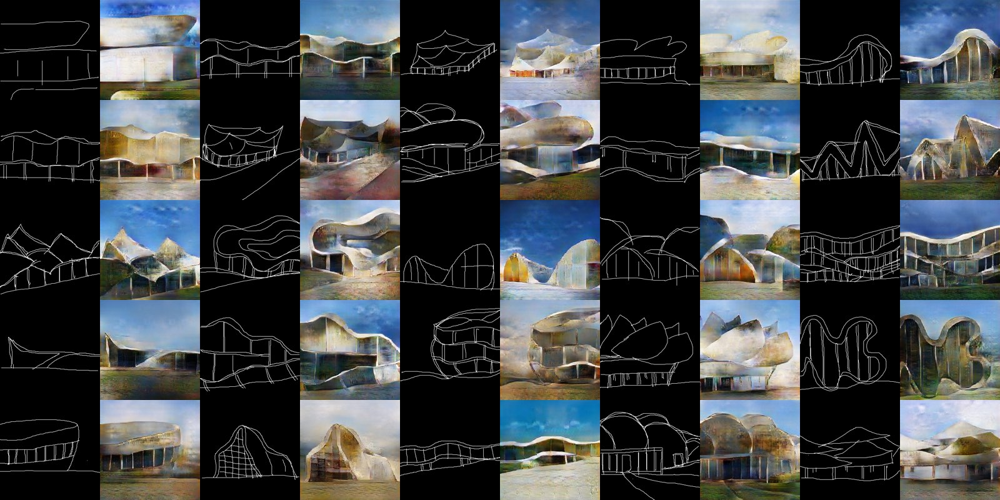

## edges2architecture (still in progress)

This is an experimental project for developing photo-realistic architecture from drawings. Architects develop their ideas from drawings. It is no exaggeration to say that drawing is the source of architecture. In general, the sketches are rough and quite conceptual because detailed sketches require so much time. These days, architects also use computers to represent their ideas with CAD (computer-aided design) software instead of drawing by hand. Computers literally can help architects embody their ideas, but they first need to create the model on computers, select the texture, and then render them to get photo-realistic images. (Rendering sometimes takes more than 24 hours).  
This project aims to skip the process of drawing detailed illustrations and modeling on computers. ‘edge2architecture’ will directly generate photo-realistic images from rough drawings. Moreover, it might develop unexpected but completely novel architectures. This is a genuine computer-aided design tool.  
The transformation is based on pix2pix and the 200 training images are taken from Pinterest.

## Examples



## Setup

1. Run ```./download_model.sh``` to download the n2p model.
2. Run ```python app.py``` to launch the generator.
3. Run ```cd ./doc & python -m SimpleHTTPServer``` to launch the web client.
4. Open ```localhost:8000``` from any browser.

## Dependencies

- [PyTorch](http://pytorch.org/)
- ```pip install flask flask_cors dominate visdom```
- ```cd vision & python setup.py install```

## Pix2pix model

The generator is based on [CycleGAN-and-pix2pix-in-PyTorch](https://github.com/junyanz/pytorch-CycleGAN-and-pix2pix) by [junyanz](https://github.com/junyanz).

## Environments

- macOS 10.12.6
- Python 3.6.0

## Author
ytakzk  
 [https://ytakzk.me](https://ytakzk.me)
